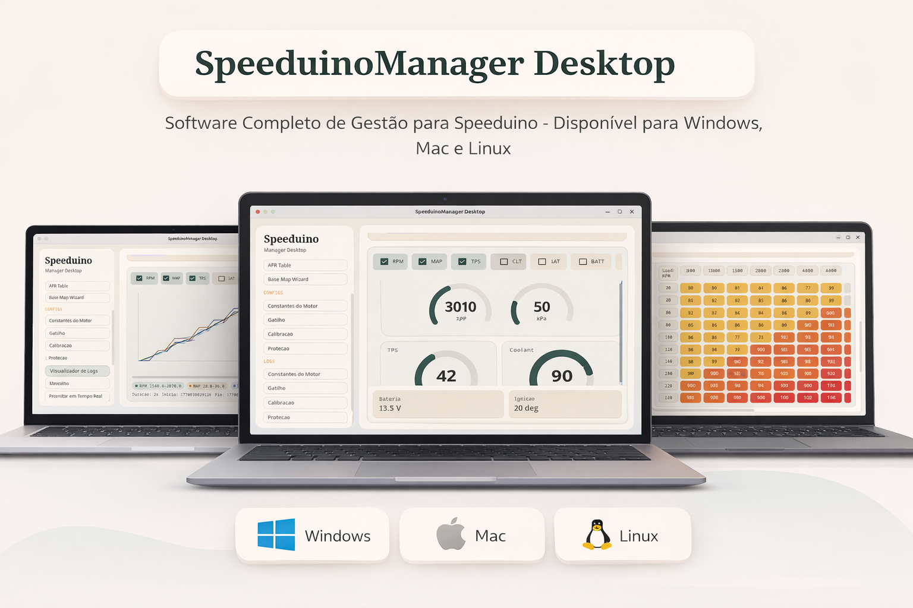

# SpeeduinoManager Desktop

Cross-platform desktop client for Speeduino ECUs, built with Kotlin Multiplatform and based on the SpeeduinoManager Android project. It reuses the Android protocol/models/connection core and delivers a modern, consistent desktop UI.

## Highlights

- Cross-platform: Windows, macOS, Ubuntu/Debian (Compose Desktop).
- Shared core with Android: protocol, models, tables, and parsers.
- Open source and extensible, focused on reuse and consistency.

## Features

- TCP (Wi-Fi) and Serial (USB/Bluetooth SPP) connections.
- Dashboard with gauges (RPM, MAP, TPS, CLT) and basic status.
- Editable maps: VE, Ignition, AFR, with color gradients.
- Base map wizard with automatic generation.
- Configs: Engine Constants and Trigger Settings.
- Logs: Real-time monitor, capture, CSV export.
- Log Viewer with plotted charts and signal selection.

## Documentation

- Creation plan: `docs/PLAN.md`
- Build and run: `docs/BUILD.md`
- Architecture and modules: `docs/ARCHITECTURE.md`

## Structure

- `shared/` - shared core (protocol, models, connections).
- `desktopApp/` - desktop UI (Compose).

## Build and run

```bash
cd SpeeduinoManagerDesktop
./gradlew :desktopApp:run
```

## Distribution

```bash
./build-release.sh
```

Generated formats:
- Windows: EXE
- macOS: DMG
- Ubuntu/Debian: DEB and AppImage

## Status

Active project, evolving alongside Android. New functionality should prioritize the `shared` module to keep cross-platform compatibility.
